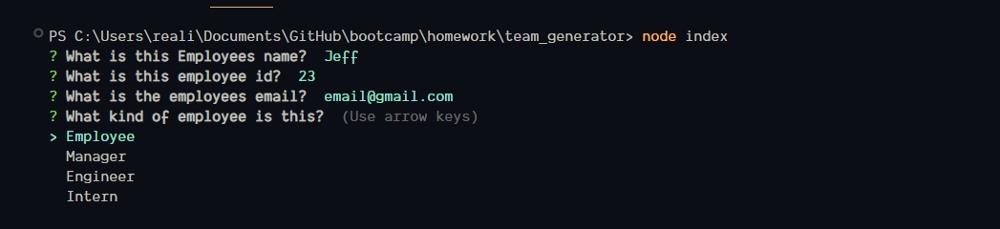
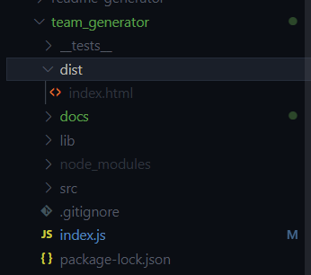

# Team UI generator

## Description

Fairly minimal team UI generator. Takes some basic info about team memebers in then dynamiclly generates a simple webpage off of it. Uses bootstrap for styling.

## Table Of Cotents

- [Requirements](#requirments)
- [Installation](#installation)
- [Usage](#Usage)

## Requirments

To run this you need to hae npm installed and nodejs installed.

## Installation
To get this up and runing simply download the repo. Extract and navigate your browser to the location of the index.js. Run `npm install` to get the required `npm modules`.

## Usage
Very simple to use first navigate to the folder where it was extracted to. Next run `node index`.

Then follow the prompted messages.

Next navigate to the dist folder and you will find the genrated html.

